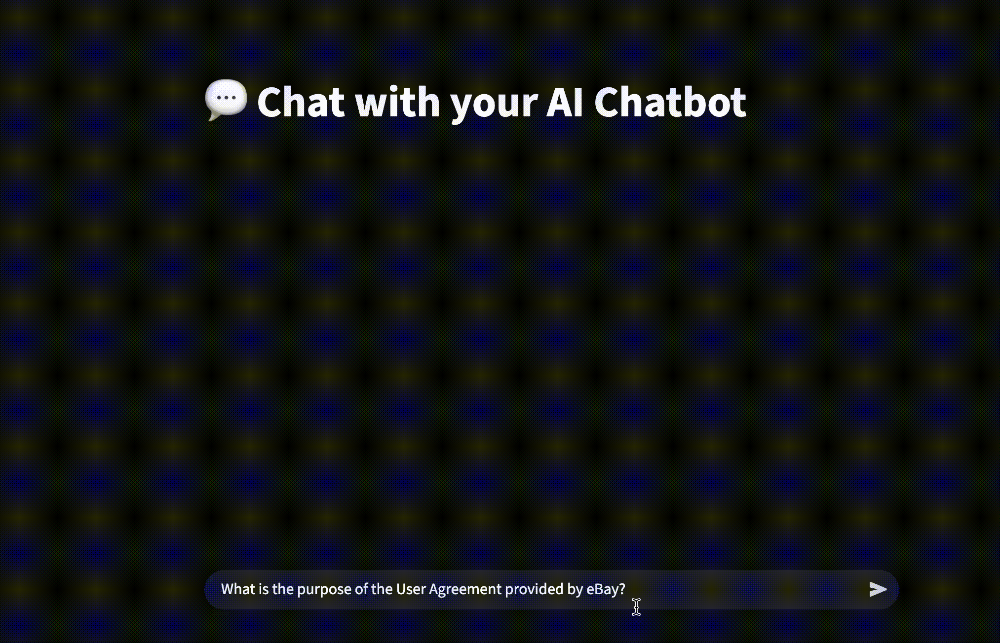

# AI Chatbot

This project implements a Retrieval-Augmented Generation (RAG) based AI chatbot that allows users to upload a PDF and ask context-specific questions. Built with **LLaMA 3.2**, **LangChain**, and **Chroma**, the system processes documents, creates vector embeddings, and interacts through a conversational UI in **Streamlit**.

---

## Architecture and Flow

```
[PDF Upload] → [Text Cleaning + Chunking] → [Embeddings via LangChain] → [Chroma Vector Store]
       ↓                                                       ↓
[User Query] → [Retriever fetches relevant chunks] → [LLM generates answer using context]
       ↓
[Streaming Response shown in Streamlit Chat Interface]
```

---

## Components Overview

- **PDF Preprocessing**: Cleaned and chunked using LangChain's `PyPDFLoader` and `RecursiveCharacterTextSplitter`.
- **Embeddings**: Generated using the default embedding model from LangChain (e.g., `HuggingFaceEmbeddings` or `Ollama embeddings`, as configured).
- **Vector Store**: Stored in `Chroma`, enabling fast and semantic retrieval.
- **LLM**: `llama3:instruct` run via local Ollama backend.
- **Interface**: Built with Streamlit; supports streaming responses and multi-turn chat via LangChain memory.

---

## Getting Started

### 1. Clone the Repository

```bash
git clone https://github.com/yourusername/AI_chatbot.git
cd AI_chatbot
```

### 2. Set Up the Environment

```bash
pyenv install 3.11.13
pyenv local 3.11.13

python -m venv llms
source llms/bin/activate  # On Windows: llms\Scripts\activate

pip install -r requirements.txt
```

---

## Preprocessing & Embedding Pipeline

### Step 1: Clean and Chunk PDF

Handled via LangChain tools in `clean_text.ipynb` or embedded code:

```python
from langchain_community.document_loaders import PyPDFLoader
from langchain.text_splitter import RecursiveCharacterTextSplitter

loader = PyPDFLoader("yourfile.pdf")
docs = loader.load()

text_splitter = RecursiveCharacterTextSplitter(chunk_size=1000, chunk_overlap=100)
chunks = text_splitter.split_documents(docs)
```

### Step 2: Create Embeddings and Store in Chroma

```python
from langchain.vectorstores import Chroma
from langchain.embeddings import HuggingFaceEmbeddings  # or any other supported

embedding = HuggingFaceEmbeddings()
db = Chroma.from_documents(chunks, embedding, persist_directory="chroma_store")
db.persist()
```

---

## RAG Chatbot with Streaming

### Step 3: Set Up RAG Chain with Streaming

In `rag_implement.py`:

```python
from langchain.chains import ConversationalRetrievalChain
from langchain.memory import ConversationBufferMemory
from langchain_community.llms import Ollama

llm = Ollama(model="llama3.2", streaming=True)
retriever = db.as_retriever(search_kwargs={"k": 5})
memory = ConversationBufferMemory(memory_key="chat_history", return_messages=True)

rag_chain = ConversationalRetrievalChain.from_llm(
    llm=llm,
    retriever=retriever,
    memory=memory,
    return_source_documents=True
)
```

---

## Launch the Chatbot

### Step 4: Start Ollama

Ensure the model is installed:

```bash
ollama run llama3:instruct
```

### Step 5: Run the App

```bash
streamlit run app.py
```

---

## Sample Queries

```text
1. What is the main topic of the document?
2. Summarize section 2 of the PDF.
3. Who is the author and what are their key points?
```

---

## Project Structure

```
AI_chatbot/
├── app.py              # Streamlit UI
├── rag_implement.py    # LangChain RAG setup
├── clean_text.ipynb    # Preprocessing and chunking
├── chroma_store/       # Vector store files
```


```
app.py              # Streamlit UI
rag_implement.py    # LangChain RAG setup (retriever, memory, LLM)
clean_text.ipynb    # Notebook for PDF preprocessing
```


